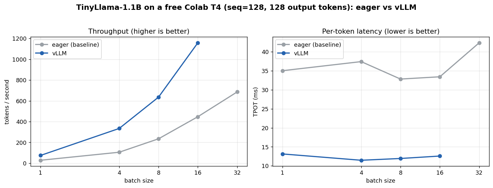

# llm-inference-optimizer

End-to-end GPU-accelerated LLM inference optimization pipeline with a benchmarking
framework, targeting **LLaMA 3 (8B / 70B)**.

**Stack:** PyTorch 2.3 · CUDA · TensorRT · ONNX · vLLM · Nsight

> 📄 **New here / student / non-technical?** Start with
> [`docs/PROJECT_OVERVIEW.pdf`](docs/PROJECT_OVERVIEW.pdf) (or
> [the Markdown version](docs/PROJECT_OVERVIEW.md)) — an elaborate, beginner-friendly
> walkthrough that explains every concept and term from scratch. This README is the
> technical companion.

## What this project does

It takes a large language model (LLM — the AI behind chatbots) and runs it through a
**6-stage pipeline** to make it faster and cheaper to serve on a GPU — then
**measures** the result precisely so the speed-ups are proven, not claimed:

**export → optimize (TensorRT + quantization) → serve (eager / ONNX / vLLM) →
profile → benchmark → analyze.**

### Key concepts (60-second glossary)

| Term | Plain-English meaning |
|---|---|
| **Inference** | *Running* a trained model to get answers (vs. *training* it). |
| **Token** | A chunk of text (~a word) the model reads/writes. |
| **GPU** | The chip that does the model's math; the costly, scarce resource. |
| **Latency** | How long you wait — **TTFT** (to first word) + **TPOT** (per later word). Lower = better. |
| **Throughput** | Tokens/second served. Higher = better (serves more users). |
| **Batching** | Handling many requests together — like a bus vs. single taxis. |
| **Quantization** | Shrinking the model (e.g. 4-bit) for speed/size, ~same quality. |
| **Baseline** | The plain reference setup to beat — here, PyTorch "eager". |
| **MFU** | Model FLOP Utilization — % of the GPU's peak compute actually used. |

*Full explanations with analogies are in the [PDF overview](docs/PROJECT_OVERVIEW.pdf).*

## What was achieved

The full pipeline is **built and validated end-to-end on a real GPU** (free Colab T4).
Measured highlights (TinyLlama-1.1B on a T4 — same hardware/model across backends):

| Result | Measurement |
|---|---|
| **vLLM vs eager throughput** | **~2.6–3.2× higher** (avg ~2.8×); **peak 1159 tok/s** at batch 16 |
| **vLLM vs eager per-token latency** | **~65% lower** (TPOT ~12 ms vs ~34 ms) |
| **Batching gain (eager)** | **~24× throughput** (28 → 686 tok/s, batch 1 → 32) |
| **Quantization** | model **~3× smaller** (2.2 GB → ~0.76 GB, AWQ/GPTQ 4-bit) |
| **Power / memory** | captured live via NVML (~45–69 W under load) |



<details><summary>Throughput by batch size (seq 128, tok/s) — eager vs vLLM</summary>

| batch | eager | vLLM | speedup |
|---:|---:|---:|---:|
| 1  | 28.4  | 74.8   | 2.6× |
| 4  | 105.6 | 334.4  | 3.2× |
| 8  | 234.8 | 635.8  | 2.7× |
| 16 | 447.4 | 1158.6 | 2.6× |

*TinyLlama-1.1B, free Colab T4, 128 output tokens. Source data + chart script:
[`docs/benchmarks/`](docs/benchmarks/). vLLM's EngineCore hits a T4 memory ceiling
above batch 16; the sweep saves all completed points (run-to-run variance ~±15%).*
</details>

*These come from a small model on free hardware; the same pipeline scales to LLaMA 3
8B on an A100 (config + notebook tier included), where the absolute gains are larger.*

### How it was built (and what it took)
Each phase was implemented, **unit-tested on CPU**, then **validated on GPU** before being
marked done. The hard part was making it run on real machines — the
[Engineering notes](#engineering-notes-hard-won-gpu-validated) below capture the
TensorRT-11 API rewrite, the three-way dependency-environment split, and the
multi-layer fix that got vLLM self-healing on Colab. Full phase log in `CLAUDE.md`.

## Original goals (targets)

- 45% latency reduction vs baseline PyTorch eager
- 2.3× throughput improvement
- GPU MFU from ~25% → 60–75%
- Full benchmark sweep: TTFT, TPOT, tokens/sec, MFU, power (NVML)

## Pipeline at a glance

```
HuggingFace LLaMA 3
   │  export_to_onnx          (Phase 2)  →  model.onnx (decoder + KV-cache)
   ▼
ONNX graph
   │  build_trt_engine        (Phase 3)  →  .engine   (TensorRT)
   │  quantize_model          (Phase 3)  →  AWQ / GPTQ / INT8 checkpoint
   ▼
InferenceEngine               (Phase 4)  →  eager / onnx / vllm backends
   │  profiler                (Phase 5)  →  latency + NVML power
   ▼
benchmark sweep               (Phase 6)  →  TTFT / TPOT / tok-s / MFU  →  CSV / JSON
   ▼
analysis + plots              (notebook 04_analysis)  →  backend comparison, speedups
```

Each stage is chained by **artifacts on disk** (an ONNX dir, a `.engine`, a quantized
checkpoint), which is what lets the stages run in separate environments (see below).

## Environment model

Development is local (CPU); all GPU work runs on Colab. The GPU side is split into
**three environments** because the stages need mutually incompatible dependency
pins — they are distinct pipeline stages chained by on-disk artifacts, so this is
correct structure, not a workaround.

| Environment | Used for | Install |
|---|---|---|
| **Local (Mac, CPU)** | code, configs, tests, git, the `eager` backend | `make setup-local` (`requirements/base.txt` + `dev.txt`) |
| **Colab GPU — main** | ONNX export, TensorRT build, INT8 quant | `requirements/gpu.txt` (transformers <5.0) |
| **Colab GPU — quant** | AWQ + GPTQ | `requirements/gpu-quant.txt` (transformers 5.x: `llmcompressor`, `gptqmodel`) |
| **Colab GPU — serve** | vLLM serving backend | `requirements/gpu-serve.txt` (vLLM pins its own torch/transformers) |

Every GPU code path guards itself with `is_cuda_available()` and fails loudly on CPU —
it never silently falls back. Start GPU sessions from `notebooks/00_colab_setup.ipynb`.

> ⚠️ **Do not mix the three GPU environments in one kernel** — `optimum` (export)
> needs transformers <5.0, while `llmcompressor`/`gptqmodel` need 5.x, and vLLM pins
> its own. Use a separate Colab session per stage.

## Quickstart (local)

```bash
make setup-local     # install CPU deps + dev tooling
make lint            # ruff + black --check + mypy
make test            # CPU-safe unit tests (incl. real eager generation)
make format          # auto-fix formatting
```

## Module layout & phase status

```
configs/             model + benchmark sweep configs
src/utils/           env detection, logging, config loaders   ✅ Phase 1 (done)
src/export/          HuggingFace → ONNX (optimum, KV-cache)    ✅ Phase 2 (done, Colab-validated)
src/optimization/    TensorRT engine build + quantization      ✅ Phase 3 (done, Colab-validated)
src/serving/         unified InferenceEngine                   ✅ Phase 4 (eager/onnx/vllm validated)
src/profiling/       PyTorch profiler + NVML power             ✅ Phase 5 (validated on Colab)
src/benchmarking/    sweep runner + MFU                        ✅ Phase 6 (validated on Colab)
notebooks/           Colab GPU workflows: 00 setup · 01 export · 02 optimize ·
                     03 benchmark · 04 analysis (plots)   (all wired)
tests/unit/          CPU-safe, run in CI
tests/integration/   GPU-only, auto-skipped on CPU
```

## Roadmap

- ✅ **Phase 1 — Scaffold + environment.** Repo, configs, CI, `env.py`/`logger.py`,
  config loaders, `calculate_mfu` + `BenchmarkResult` (CPU-safe).
- ✅ **Phase 2 — ONNX export.** `export_to_onnx` via HF Optimum
  (`text-generation-with-past`, KV-cache + dynamic axes). PyTorch-vs-ONNX parity
  verified on a tiny model (Colab T4).
- ✅ **Phase 3 — TensorRT + quantization.** *Validated on Colab.*
  - `build_trt_engine` (fp16/fp32): parses the ONNX, builds one optimization
    profile over batch/sequence/past-length, serializes + verifies the `.engine`.
  - `quantize_model`: **INT8** (bitsandbytes), **AWQ** (llmcompressor),
    **GPTQ** (gptqmodel); **FP8** gated to H100. INT8/FP8 TRT-engine precisions
    are deferred (need a calibrator / ONNX Q-DQ).
- ✅ **Phase 4 — Serving runtime.** *Validated.* `InferenceEngine` with a single
  `generate()` contract over backends:
  - **eager** (HF `.generate`, CPU+GPU) — unit-tested on CPU (real generation).
  - **onnx** (optimum `ORTModelForCausalLM`) — validated on Colab.
  - **vllm** (continuous batching + chunked prefill) — validated on Colab
    (TinyLlama-1.1B). Self-heals Colab's cu13-vLLM-on-cu12-torch runtime
    (lib preload + `LD_LIBRARY_PATH` + spawn workers).
  - **trt** serving (hand-rolled decode loop) and **Medusa** speculative decoding
    are deferred to follow-ups.
- ✅ **Phase 5 — Profiling.** *Validated on Colab T4.* `profile_generation`
  (black-box over any backend): TTFT, TPOT, throughput, peak CUDA memory, and
  mean/peak NVML power (background sampler). CPU-runnable for timing; GPU metrics
  degrade to sentinels off-GPU. torch.profiler op-level traces deferred.
- ✅ **Phase 6 — Benchmarking.** *Validated on Colab T4.* `run_sweep` drives the
  engine across the batch × seq grid, profiles each point, computes real MFU%
  (GPU peak TFLOPs × measured throughput) → CSV/JSON. `03_benchmark.ipynb` loops
  backends for the eager-vs-onnx-vs-vllm comparison.
- ⏳ **Phase 7 — Nsight.** `nsys`/`ncu` profiling — requires bare-metal GPU
  (Lambda Labs / RunPod); not available on Colab.

## Engineering notes (hard-won, GPU-validated)

These surfaced during real Colab runs and are baked into the code & requirements:

- **TensorRT 11** removed the precision `BuilderFlag`s (`FP16`/`INT8`/`FP8`),
  `EXPLICIT_BATCH`, and `platform_has_fast_fp16`. Precision now comes from the ONNX
  tensor types via a **strongly-typed network**; the builder detects this and adapts.
- **Install `tensorrt-cu12`, not bare `tensorrt`** (the latter pulls a CUDA-13 build →
  `libcudart.so.13` mismatch on Colab's CUDA 12). Same trap on `onnxruntime-gpu` — the
  export uses **CPU `onnxruntime`** (the parity check is correctness-only).
- **`autoawq` and `auto-gptq` are dead** (import-break / build-fail on current stacks);
  replaced by `llmcompressor` / `gptqmodel`, which require transformers 5.x — hence the
  separate quant environment.
- **Quantization needs a real model, not the tiny test model** — AWQ/GPTQ group quant
  (`group_size=128`) requires weight dims divisible by 128. Validation uses
  `TinyLlama-1.1B`; `tiny-random` is only for export/TRT graph structure.

## Repo tour — where to look

| If you want to… | Look at |
|---|---|
| Understand the project with zero background | [`docs/PROJECT_OVERVIEW.pdf`](docs/PROJECT_OVERVIEW.pdf) |
| See the measured results + chart | this README's [What was achieved](#what-was-achieved) · [`docs/benchmarks/`](docs/benchmarks/) |
| Read the code, one stage per folder | [`src/`](src/) (`export`, `optimization`, `serving`, `profiling`, `benchmarking`) |
| See how the GPU runs were driven | [`notebooks/`](notebooks/) (00 setup → 04 analysis) |
| Reproduce the tests | `make test` (CPU-safe unit tests) |
| Read the full build log + design decisions | [`CLAUDE.md`](CLAUDE.md) |

## More

See **`CLAUDE.md`** for full module contracts, config schemas, coding standards, and
the detailed phase log. The [`docs/PROJECT_OVERVIEW.pdf`](docs/PROJECT_OVERVIEW.pdf) is
regenerated (with the Markdown mirror) by `python scripts/make_overview_pdf.py`.
